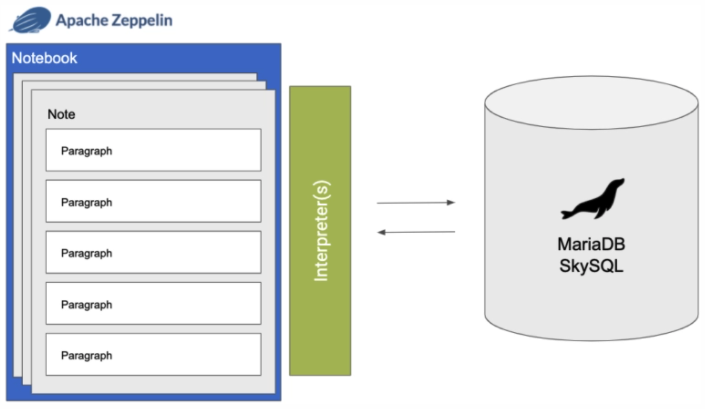

# Modern SQL, MariaDB, and Apache Zeppelin!

⚠️ **[UNMAINTAINED]** This repository has been moved and is currently maintained [here](https://github.com/mariadb-developers/mariadb-modern-sql-samples). ⚠️

<br />

[MariaDB](http://www.mariadb.com) implements more of the standard SQL specification than any other open source database, adding support for [common table expressions (CTEs)](https://mariadb.com/kb/en/with/), [window functions](https://mariadb.com/kb/en/window-functions/), [temporal data tables](https://mariadb.com/kb/en/temporal-data-tables/) and many other features over the last few years. 

<p align="center" spacing="10">
    <kbd>
        
    </kbd>
</p>

The following will walk you through the steps for setting up [Apache Zeppelin](https://zeppelin.apache.org/) to integrate with MariaDB and work with several samples of modern SQL functionality. 

# Table of Contents
1. [Requirements](#requirements)
2. [Introduction to MariaDB](#introduction)
    1. [MariaDB Platform](#platform)
    2. [MariaDB SkySQL](#skysql)
3. [Preparing the database](#prepare)
    1. [Create the schema](#schema)
    2. [Load the data](#data)
4. [Using Apache Zeppelin](#getting-started)
    1. [Adding a MariaDB Interpreter](#add-interpreter)
    2. [Importing Zeppelin notes](#import-note)
5. [Raw Queries](#queries)
6. [Support and Contribution](#support-contribution)
7. [License](#license)

## Environment and Compatibility <a name="requirements"></a>

This project assumes you have familiarity with building web applications using ReactJS and NodeJS technologies. 

* Download and install [MariaDB](#introduction). 
* Download and install [Apache Zeppelin](https://zeppelin.apache.org/download.html).
* git (Optional) - this is required if you would prefer to pull the source code from GitHub repo.
    - Create a [free github account](https://github.com/) if you don’t already have one
    - git can be downloaded from git-scm.org

## Introduction to MariaDB <a name="introduction"></a>

### MariaDB Platform <a name="platform"></a>

[MariaDB Platform](https://mariadb.com/products/mariadb-platform/) integrates [transactional](https://mariadb.com/products/mariadb-platform-transactional/) and [analytical](https://mariadb.com/products/mariadb-platform-analytical/) products so developers can build modern applications by enriching transactions with real-time analytics and historical data, creating insightful experiences and compelling opportunities for customers – and for businesses, endless ways to monetize data. 

<p align="center" spacing="10">
    <kbd>
        
    </kbd>
</p>

To get started using MariaDB locally you can choose one of the following options:

* [Download and install MariaDB (Community or Enterprise) directly from mariadb.com](https://mariadb.com/docs/deploy/installation/) 

* [Download and install MariaDB using the official MariaDB Community Server 10.5 Docker Image available at hub.docker.com](https://hub.docker.com/r/mariadb/columnstore)

### MariaDB SkySQL <a name="skysql">

[SkySQL](https://mariadb.com/products/skysql/) is the first and only database-as-a-service (DBaaS) to bring the full power of MariaDB Platform to the cloud, including its support for transactional, analytical and hybrid workloads. Built on Kubernetes, and optimized for cloud infrastructure and services, SkySQL combines ease of use and self-service with enterprise reliability and world-class support – everything needed to safely run mission-critical databases in the cloud, and with enterprise governance.

[Get started with SkySQL!](https://mariadb.com/products/skysql/#get-started)

<p align="center" spacing="10">
    <kbd>
        
    </kbd>
</p>

## Preparing the database <a name="prepare"></a>

### Create the schema <a name="schema"></a>

Next execute the SQL within [schema.sql](sql/schema.sql) either manually within a new database, or using the MariaDB client:

Locally (with root and empty password):
```bash
$ mariadb < sql/schema.sql
```

MariaDB SkySQL:
```bash
mariadb --host tx-1.mdb0001390.db.skysql.net --port 5002 --user DB00003108 -pPassword123! --ssl-ca ~/Downloads/skysql_chain.pem < sql/schema.sql>
```

**Note:** The previous commands assume you have the MariaDB client installed, the relative locations of [schema.sql](sql/schema.sql) and the skysql_chain.pem file residing in a directory called `Downloads`. But all things are configurable :)

The script will create the following tables within a database called `demo`:

* `supers`
* `teams`
* `supersteams`

### Load the data <a name="data"></a>

Once the database and tables have been created, execute the [data.sql](sql/data.sql) script to load data into the tables.

```bash
$ mariadb < sql/data.sql
```

## Getting started with Apache Zeppelin<a name="getting-started"></a>

### Adding a MariaDB interpreter <a name="add-interpreter></a>

For a more comprehensive step-by-step walk-through of how to setup and use Zeppelin with MariaDB check out [this blog post](https://mariadb.com/resources/blog/create-beautiful-data-with-mariadb-skysql-and-apache-zeppelin/)!

After you've downloaded and installed Apache Zeppelin you will need to add a new [interpreter](https://zeppelin.apache.org/docs/0.8.2/usage/interpreter/overview.html) for MariaDB using the following steps:

1. Navigate to "Interpreter".

<p align="center" spacing="10">
    <kbd>
        
    </kbd>
</p>

2. Click the "Create" button.

3. Enter a name for the interpreter and select an "Interpreter group" of `jdbc`.

<p align="center" spacing="10">
    <kbd>
        
    </kbd>
</p>

4. Assign value of **org.mariadb.jdbc.Driver** to `default.driver`.

5. Assign value of **jdbc:mariadb://<database_address>/** (where <database_address> is the location of your MariaDB database instance) to `default.url`.

6. Assign value to `default.user`.

7. Assign value to `default.password`.

8. Add the location of the [JDBC driver](https://mariadb.com/downloads/#connectors) as an artifact.

<p align="center" spacing="10">
    <kbd>
        
    </kbd>
</p>

### Importing notes <a name="import-notes"></a>

In Zeppelin, a notebook is simply a collection of notes, which is a collection of “paragraphs”. Each paragraph then uses an interpreter (via MariaDB Connector/J) to connect to and communicate with a datasource (MariaDB).

<p align="center" spacing="10">
    <kbd>
        
    </kbd>
</p>

This repo contains several notes that demonstrate a variety of modern SQL capabilities within MariaDB. 

* [demo_1](zeppelin/demo_1.json), [demo_4](zeppelin/demo_4.json): Set operators, table value constructors, aggregation functions, and rollups. 
* [demo_2](zeppelin/demo_2.json), [demo_5](zeppelin/demo_5.json): Window functions and common table expressions (recursive).
* [demo_3](zeppelin/demo_3.json), [demo_6](zeppelin/demo_6.json): Temporal tables.
* [bitemporal-table-demo](bitemporal-table-demo.json): A comprehensive look at a MariaDB Bitemporal table. 

Notes can be imported into Zeppelin by clicking the "Import Note" button, and providing a valid `json` note file.

<p align="center" spacing="10">
    <kbd>
        
    </kbd>
</p>

## Raw Queires <a name="queries"></a>

If you'd prefer to execute the SQL queries contained within the Apache Zeppelin you can find them all within [demos.sql](sql/demos.sql).

## Support and Contribution <a name="support-contribution"></a>

Please feel free to submit PR's, issues or requests to this project project directly.

If you have any other questions, comments, or looking for more information on MariaDB please check out:

* [MariaDB Developer Hub](https://mariadb.com/developers)
* [MariaDB Community Slack](https://r.mariadb.com/join-community-slack)

Or reach out to us diretly via:

* [developers@mariadb.com](mailto:developers@mariadb.com)
* [MariaDB Twitter](https://twitter.com/mariadb)

## License  <a name="license"></a>
[](https://opensource.org/licenses/Apache-2.0)
